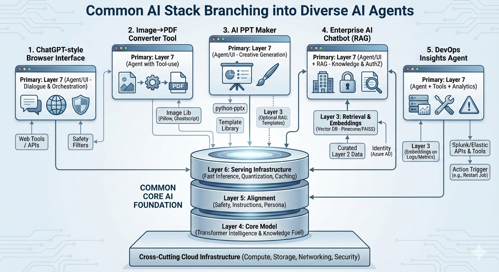

## Introduction

In the **layered AI reference model**, **AI agents primarily live in** **_Layer 7: User Interface & Agents_**, but they **reach down into lower layers** via tools, integrations, and data to actually get work done. Think of Layer 7 as the **orchestrator** of a full stack:

- **Layer 7 (Agents/UI)**: Dialogue management, context engineering, tool/function calling, workflow orchestration, safety.
- **Layers 6 → 4**: Serve the model efficiently (Layer 6), use the aligned model’s capabilities (Layer 5), and draw on the core Transformer intelligence (Layer 4).
- **Layers 3 → 2**: Retrieve and embed enterprise knowledge (Layer 3) from curated data sources (Layer 2).
- **Cloud Infrastructure (cross‑cutting) + Layer 1**: Provide the compute, networking, storage, and interconnects that make all of the above fast and reliable.

  
## **Where AI agents fit—and how they span layers**

| Layer 7 | Agent Shell (Conversation + Orchestration)**  | - Dialogue Manager: Tracks history, intent, next action. - Tool/Function Calling: Invokes APIs, scripts, databases. - Context Engineering: Manages token budget, summaries, memory. - Safety Guardrails: Prompt‑injection defenses, policy filters. |
| ------- | --------------------------------------------- | ---------------------------------------------------------------------------------------------------------------------------------------------------------------------------------------------------------------------------------------------------------------------------- |
| Layer 6 | Serving                                   | - Low‑latency inference (vLLM/TGI/TensorRT‑LLM), KV‑cache management, quantization → lets agents respond quickly.                                                                                                                                                        |
| Layer 3 | Retrieval & Embeddings (often called RAG) | - Embeddings + vector search (FAISS, Pinecone, Cognitive Search vector) to fetch relevant enterprise documents, logs, metrics.                                                                                                                                           |

**Cloud Infrastructure (cross‑cutting)**
AKS/Kubernetes, storage (Blob/S3), networking (InfiniBand/RoCE), schedulers (Ray/Slurm), observability—keep agents scalable, secure, and integrated.

## **Mapping some AI Agent examples to the layered model**

| **Agent Example**                                       | **Primary Layer**                       | **Key Supporting Layers**                    | **Typical Tools/Tech**                                                                              | **What it does across layers**                                                                                                       |
| ------------------------------------------------------- | --------------------------------------- | -------------------------------------------- | --------------------------------------------------------------------------------------------------- | ------------------------------------------------------------------------------------------------------------------------------------ |
| **ChatGPT / Gemini / Copilot-style browser interface**  | **Layer 7 (Agent/UI)**                  | L6 serving, L5 alignment, L4 core model      | UI (web/app), function calling, safety filters; vLLM/TGI; model APIs (Azure OpenAI, Vertex)         | Orchestrates dialogue, calls tools/APIs (web browsing, code, images), applies guardrails; depends on fast serving and aligned models |
| **Image→PDF converter (prompt-based tool)**             | **Layer 7 (Agent with tool-use)**       | L6                                           | Tool/function calling to an image lib (Pillow, Ghostscript), storage                                | Agent receives a file, invokes a converter tool, returns PDF; minimal retrieval; latency/key-cache optimizations help batching       |
| **AI PPT maker from prompts**                           | **Layer 7 (Agent/UI)**                  | L6, L3 (optional RAG for templates), Cloud   | python-pptx, template libraries, vector DB for brand guides                                         | Converts prompt → outline → slides; may retrieve brand assets; calls doc APIs; serves results via storage endpoints                  |
| **Enterprise AI chatbot (company knowledge)**           | **Layer 7 (Agent/UI + RAG)**            | **L3 (embeddings/vector search)**, L6, Cloud | Ingestion to vector DB (Pinecone/FAISS/Cognitive Search), LangChain/LlamaIndex, identity (Azure AD) | Uses retrieval to answer with citations; enforces authZ; depends on curated Layer 2 data and fast Layer 6 serving                    |
| **DevOps insights agent (observability + Splunk logs)** | **Layer 7 (Agent + Tools + Analytics)** | L3 (embeddings on logs), L6, Cloud           | Splunk/Elastic APIs, OpenTelemetry, KQL/Log Analytics, LangChain tools                              | Queries logs/metrics, summarizes failures, correlates pipeline events; can trigger actions (restart job) via function calls          |

## **Reference patterns for agents on Azure**

### **Pattern A: RAG Chat Agent (Enterprise Knowledge)**
- **Layer 2/3**: Ingest docs → **Azure Cognitive Search (vector)** or **Pinecone**; embeddings via **Azure OpenAI** or **HF**.
- **Layer 6**: Serve model with **AKS + vLLM/TGI**; monitor with **Prometheus/Grafana**.
- **Layer 7**: Build agent with **Semantic Kernel** or **LangChain**; tool calls for search, SQL; **Azure AD** for authZ; **Content Safety** for guardrails.

### **Pattern B: DevOps Insights Agent**
- **Cloud**: Connect **Azure Monitor / Log Analytics**, **Splunk**, **App Insights**, **OpenTelemetry**.
- **Layer 3**: Embed logs/incidents for similarity search; maintain incident memory.
- **Layer 7**: Agent tools for KQL, Splunk queries, pipeline APIs (GitHub/Azure DevOps); explain failure causes; propose fixes; trigger safe actions via **Azure Functions** with policy controls.

### **Pattern C: Document Automation Agent (Image→PDF, PPT Maker)**
- **Layer 7**: Agent workflow with tools (python‑pptx, Pillow, docx/pdf libs).
- **Layer 6**: Batch serve for throughput; optional quantization for cost.
- **Cloud**: Store artifacts in **Blob Storage**; expose via **API Management**; audit logs.

## **What makes an “AI agent” (vs. a plain LLM)?**

1. **Goal‑directed behavior** (not just answering): plans steps, selects tools.
2. **Tool‑use / function calling**: APIs, scripts, databases, automations.
3. **Memory & context**: conversation history, summaries, user profile.
4. **Safety & policy**: guardrails, role‑based access, data boundaries.
5. **Integration**: connects to enterprise systems (CI/CD, CRM, observability).

## Managed Services Model

In a "Managed Service" model (like using Azure OpenAI, Google Vertex AI, or AWS Bedrock), the boundaries of the stack shift significantly.

| **Layer**   | **Component**     | **Is it Managed? (e.g., Azure OpenAI)** | **Responsibility**                                                                              |
| ----------- | ----------------- | --------------------------------------- | ----------------------------------------------------------------------------------------------- |
| **Layer 4** | **Core Model**    | **Yes**                                 | Microsoft/OpenAI manages the Transformer weights, pre-training, and updates.                    |
| **Layer 5** | **Alignment**     | **Yes**                                 | The provider performs the RLHF and safety tuning. You just pick the "Instruct" version.         |
| **Layer 6** | **Serving Infra** | **Yes**                                 | **Crucial:** In this model, you don't manage vLLM or GPUs. You get an API endpoint with an SLA. |
**Layer 7 / UI can be entirely custom built or hybrid or managed (Azure OpenAI Assistants API or Microsoft Copilot Studio)**
## **Design checklist for robust agents**
1. **Context budget**: Summaries, chunking, structured prompts to stay within token limits (Layer 7/3).
2. **Retrieval hygiene**: Freshness, authZ filtering, citations (Layer 3/2).
3. **Tool gating**: Allow‑list functions; parameter validation; error handling (Layer 7).
4. **Safety**: Prompt‑injection defenses, PII redaction (**Presidio**), content safety filters (Layer 5/7).
5. **Observability**: Tracing, metrics, cost controls (Layer 6/Cloud).
6. **Governance**: RBAC via **Azure AD**, data boundaries, model/endpoint registries (Cloud).

## **TL;DR**
- **AI agents are the “Penthouse” (Layer 7)**—the user‑facing orchestrators.
- They **depend** on lower layers for fast serving (Layer 6), aligned behavior (Layer 5), core intelligence (Layer 4), and enterprise knowledge via retrieval (Layers 3 & 2).

